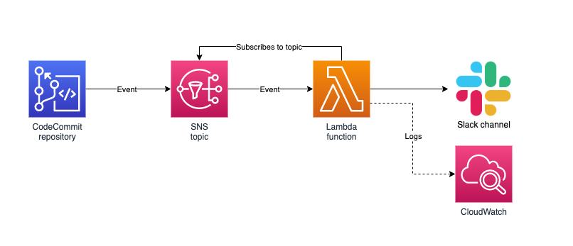
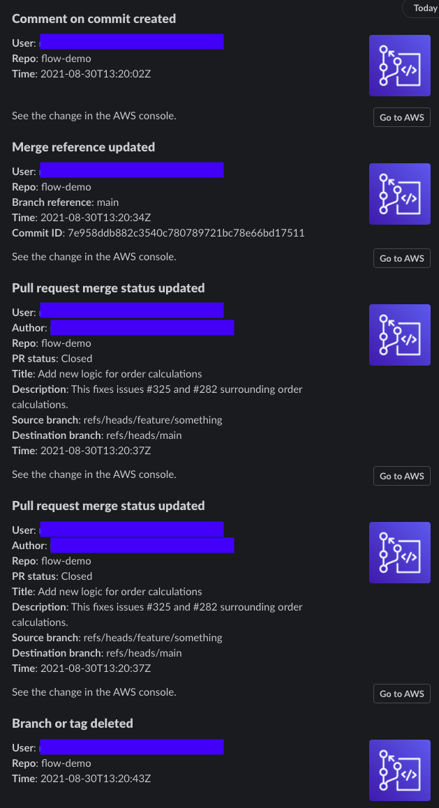

# CodeCommit Slack notification bot

**Simple serverless Slack bot for notifying about AWS CodeCommit events.**

If you want smooth and easy notifications of what's going on in CodeCommit you have maybe found out that it's a bit limited right off the bat. However, since CodeCommit can use SNS and SNS in turn has a lot of possible targets, it's pretty simple to set up a Slack integration.

One benefit on a "self-made" integration, as opposed to the AWS Chatbot solution, is that you have complete control in this case and don't have to give AWS any permissions etc.

This project uses [Serverless Framework](https://www.serverless.com) to deploy the actual Lambda function, and the SNS topic you will have to do by hand (instructions provided below!). It is expected that you already have some CodeCommit repo up and running.

## Prerequisites

- AWS account and logged in through environment
- High enough credentials in AWS to create services like SNS and Lambda
- Node 14 or later installed
- Administrator rights in Slack

## How it can look like in Slack

## Instructions

### Slack

- Go to the [API docs](https://api.slack.com)
- Click `Create an app`
- Click `From scratch`
- Give it a name and workspace
- Select `Incoming Webhooks: Post messages from external sources into Slack`
- Toggle the switch to the `On` mode
- Click `Add New Webhook to Workspace`
- Select the channel you want the bot to write to; then allow it
- Copy the hook URL and paste the part that looks like `/services/RANDOM/RANDOM/LONG_RANDOM` into `serverless.yml` under the `provider.environment.SLACK_HOOK_PATH` key

### AWS

- Create a standard SNS topic called `slackbot`. You are welcome to change this if you want, but in that case you'll also need to update the policy.
- Use the provided policy (`policy.json`) exchanging the bogus account number and region for your values. Note that the policy is fairly wide, but this shouldn't be too much of a security concern... KMS is also disabled. All these aspects are that way because CodeCommit can be really finicky to get going :/
- Create a notification rule on your CodeCommit repository. Add any events you are interested in. As the target, set your newly-created SNS topic.

### Code editor

- Install dependencies with `npm install` or `yarn`
- Deploy with `sls deploy`
- When it's deployed you'll receive an endpoint: copy that down and use it in case you want to manually call the function

Done!

## CodeCommit notification events

This codebase supports all eleven CodeCommit events:

### Comments

- On commits
- On pull requests

### Approvals

- Status changed
- Rule override

### Pull request

- Source updated
- Created
- Status changed
- Merged

### Branches and tags

- Created
- Deleted
- Updated

## Using the service

_Note that the service/bot does not by default log anything, so add any `console.log()`s or whatever as you need, if you need them._

### Live

Start doing things to your CodeCommit repository and Slack should begin to display messages.

### Using test data

You can use one of the eleven provided NPM scripts to send test data to your local offline endpoint. Just substitute your local URL for your remote URL if you want to run the remote instead.

For all of the below, add `npm run` or `yarn run` in front of the command.

The commands are:

- `event:comment:commit`
- `event:comment:pr`
- `event:pr:approval:overridden`
- `event:pr:approval:changed`
- `event:pr:created`
- `event:pr:merge:updated`
- `event:pr:source:updated`
- `event:pr:changed`
- `event:ref:updated:merge`
- `event:ref:updated`
- `event:ref:deleted`

## References

- [Slack API docs](https://api.slack.com)
